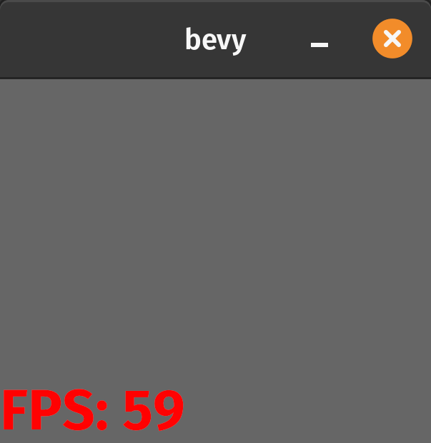

# Bevy diagnostics overlay

[](https://crates.io/crates/bevy_screen_diags)
[](https://github.com/bevyengine/bevy/blob/main/docs/plugins_guidelines.md#main-branch-tracking)

`bevy_screen_diags` adds a very simple frames-per-second (FPS) display to your screen in Bevy.

It was inspired by (and copied from) https://github.com/bevyengine/bevy/blob/main/examples/ui/text.rs.

## Usage

Put the crate into your `Cargo.toml`.

```toml
bevy_screen_diags = "0.6.0"
```

Include the plugin when you build your `App`.

```rust
fn main() {
    App::new()
        .add_plugins(DefaultPlugins)
        .add_plugin(bevy_screen_diags::ScreenDiagsTextPlugin)
        //If a UI camera is already in your game remove the next line
        .add_systems(Startup, |mut commands: Commands| {
            commands.spawn_bundle(Camera2dBundle::default());
        });
}
```

Put the font you want to use in `assets/fonts/screen-diags-font.ttf`. If you want, you can use
the font at that path in this project (which is FiraSans-Bold).



The `basic` example just shows the FPS count on a grey background, but you can click your mouse on
the window to add or remove the display.

The `customized` example uses the `ScreenDiagsText` marker component to tweak the font and position of the FPS display.

Contributions to the crate are welcome.
